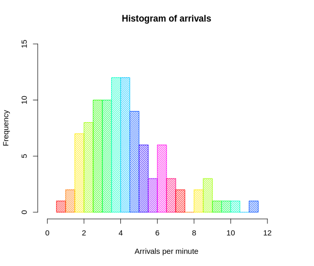

# 4. Visual Histogram [Haskell]

Write a simple **stand-alone** program that displays a histogram of given numbers in a "visual way" (in a text-based console).

It should read a line of **space-separated real values** and a line of a **single integer** (the number of bins) from the standard input.

Then it should print a **visual representation of their histogram** to the standard output.

## Histogram (from Wikipedia)

To construct a histogram:
1. "Bin" the range of values:
divide the entire range of values into a series of intervals (called *bins*).
The bins are (in our case):
    * consecutive
    * non-overlapping 
    * adjacent 
    * of equal size (width).
2. Count how many values fall into each bin.

Thus, for the following example of a histogram:



* *Arrivals per minute* (and their intervals) represent *bins*.
* *Frequency* represents the *count* in each bin.

E.g. for 5 bins, the interval [0, 1] would be split into following 5 bins:
1. [0, 0.2)
2. [0.2, 0.4)
3. [0.4, 0.6)
4. [0.6, 0.8)
5. [0.8, 1]

*(For simplicity, assume the maximum value always belongs to the last bin.)*

## Input
Two lines are read from the standard input.

The first line contains **space-separated** real numbers (possibly with the *minus* signs and *decimal points*).

The second line contains a single positive integer **n >= 1** (the number of bins). 

You may assume that the user-given input is **always valid**.
In particular, at least one value will be always entered and only numbers in the correct (specified) format are given.

## Output
There will be **n** lines in the standard output.

For every *1 <= i <= n*, the **i-th** line consists of (in this order):

1. the character `:`
2. **b_i**-times character `|` where *b_i* is the number of (input) values that fall into the *i-th bin*
2. the newline `\n`

## Hints
* It might be helpful to *normalize* values into the interval [0, 1].
So the minimum value is mapped to 0 and the maximum value to 1.

* Keep in mind that there are many useful functions in the `Prelude` of Haskell,
e.g. `map`, `read`, `words`, `subtract`, `min`, `fromIntegral`, `length`, `filter`, `concat`, `replicate`, `putStr` and `readLn`.
Other Haskell things such as `.`, `$`, *operator sections* or *list comprehension* can be also useful.
They may help you implement the solution very rapidly.

* Moreover, it could be also useful to implement a parsing function:
```haskell
stringToDoubles :: String -> [Double]
```

**TODO Are following hints necessary?**

## Examples

#### Example 1
Input:
```
1 2 3 4
3
```
Output:
```
:|
:|
:||
```
___

Input:
```
1 2 3 4
6
```
Output:
```
:|
:
:|
:
:|
:|
```

#### Example 2
Input:
```
-3.14 -3 -2 -1 0 1 2 3 3.14
4
```
Output:
```
:|||
:|
:||
:|||
```
___
Input:
```
-3.14 -3 -2 -1 0 1 2 3 3.14
8
```
Output:
```
:||
:|
:|
:
:|
:|
:|
:||
```

#### Example 3 (sampled from normal distribution)
Input:
```
4 10 5 -2 5 9 -8 -12 -2 10 -8 4 4 -5 -8 7 11 -4 -8 -20 20 -2 -22 11 7 7 20 -15 9 -6 -12 4 -9 8 11 8 8 -11 -7 13 6 2 -12 -7 -9 21 -9 4 -8 19 -8 9 9 2 -4 13 16 6 12 -8 5 -8 -1 8 -2 -29 20 -18 -5 10 1 -12 -4 11 -8 -2 17 8 -13 3 3 -10 10 3 -8 13 -4 -12 -15 -4 8 -6 8 -6 0 -5 10 13 -16 -13 -1 -2 14 -2 -2 -23 8 -3 -13 15 -25 18 -5 -2 -11 -8 4 -8 3 1 -6 -7 11 8 -1 -8 -7 1 23 -8 -12 -12 13 2 -1 0 21 -11 9 -10 -8 5 -1 1 -5 8 -8 1 2 -3 11 -16 6 -6 -1 4 -1 10 0 -11 -12 -11 8 6 6 -19 5 6 -3 0 6 11 16 6 -5 3 3 12 13 15 -4 -6 5 -1 4 4 20 15 -13 -1 -11 4 8 -7 -8 2 5 -8 -2 -6 -4 8 -6 -7 2 15 -14 -2 -12 -2 5 4 -9 2 -6 6 13 16 -5 -7 21 9 2 15 -2 -9 0 18 21 -9 2 14 14 -2 6 3 1 14 5 12 20 1 2 4 9 -18 2 -2 19 7 -21 7 -8 11 -7 6 -9 -11 11 -16 -35 -3 3 -16 8 0 11 3 5 -10 5 0 9 3 -13 -5 2 1 -5 -6 -4 -10 -1 -8 0 6 5 -4 -5 16 -4 -10 1 11 0 -8 7 12 6 -3 2 -15 1 -12 -14 -12 15 9 7 -3 6 27 -19 4 6 -19 0 -8 9 21 -2 -10 -8 -1 3 1 -8 1 5 -15 5 -4 -11 -6 -1 8 6 -5 -9 3 0 22 4 3 5 1 -4 -3 -7 18 0 30 15 1 1 -1 -11 -5 8 12 -1 -15 -10 -4 6 -17 -9 -1 -5 -14 9 -20 11 0 -10 19 14 17 22 3 0 -1 2 -2 4 -7 -12 0 -6 18 -4 1 30 -17 -27 23 5 0 3 -15
10
```
Output:
```
:||
:|||
:|||||||||||||||
:|||||||||||||||||||||||||||||||||||||||||||
:|||||||||||||||||||||||||||||||||||||||||||||||||||||||||||||||||||||||||||||||||||||||||
:||||||||||||||||||||||||||||||||||||||||||||||||||||||||||||||||||||||||||||||||||||||||||||||
:||||||||||||||||||||||||||||||||||||||||||||||||||||||||||||||||||||||||||||||||||||||||
:||||||||||||||||||||||||||||||||||||||||
:|||||||||||||||||||||||
:|||
```
___
Input:
```
4 10 5 -2 5 9 -8 -12 -2 10 -8 4 4 -5 -8 7 11 -4 -8 -20 20 -2 -22 11 7 7 20 -15 9 -6 -12 4 -9 8 11 8 8 -11 -7 13 6 2 -12 -7 -9 21 -9 4 -8 19 -8 9 9 2 -4 13 16 6 12 -8 5 -8 -1 8 -2 -29 20 -18 -5 10 1 -12 -4 11 -8 -2 17 8 -13 3 3 -10 10 3 -8 13 -4 -12 -15 -4 8 -6 8 -6 0 -5 10 13 -16 -13 -1 -2 14 -2 -2 -23 8 -3 -13 15 -25 18 -5 -2 -11 -8 4 -8 3 1 -6 -7 11 8 -1 -8 -7 1 23 -8 -12 -12 13 2 -1 0 21 -11 9 -10 -8 5 -1 1 -5 8 -8 1 2 -3 11 -16 6 -6 -1 4 -1 10 0 -11 -12 -11 8 6 6 -19 5 6 -3 0 6 11 16 6 -5 3 3 12 13 15 -4 -6 5 -1 4 4 20 15 -13 -1 -11 4 8 -7 -8 2 5 -8 -2 -6 -4 8 -6 -7 2 15 -14 -2 -12 -2 5 4 -9 2 -6 6 13 16 -5 -7 21 9 2 15 -2 -9 0 18 21 -9 2 14 14 -2 6 3 1 14 5 12 20 1 2 4 9 -18 2 -2 19 7 -21 7 -8 11 -7 6 -9 -11 11 -16 -35 -3 3 -16 8 0 11 3 5 -10 5 0 9 3 -13 -5 2 1 -5 -6 -4 -10 -1 -8 0 6 5 -4 -5 16 -4 -10 1 11 0 -8 7 12 6 -3 2 -15 1 -12 -14 -12 15 9 7 -3 6 27 -19 4 6 -19 0 -8 9 21 -2 -10 -8 -1 3 1 -8 1 5 -15 5 -4 -11 -6 -1 8 6 -5 -9 3 0 22 4 3 5 1 -4 -3 -7 18 0 30 15 1 1 -1 -11 -5 8 12 -1 -15 -10 -4 6 -17 -9 -1 -5 -14 9 -20 11 0 -10 19 14 17 22 3 0 -1 2 -2 4 -7 -12 0 -6 18 -4 1 30 -17 -27 23 5 0 3 -15
20
```
Output:
```
:|
:|
:|
:||
:|||||||
:||||||||
:||||||||||||||
:|||||||||||||||||||||||||||||
:|||||||||||||||||||||||||||||||||||||||||||||||||||||||
:||||||||||||||||||||||||||||||||||
:|||||||||||||||||||||||||||||||||||||||||||||||||
:|||||||||||||||||||||||||||||||||||||||||||||
:|||||||||||||||||||||||||||||||||||||||||||||||||||||||
:|||||||||||||||||||||||||||||||||
:||||||||||||||||||||||||
:||||||||||||||||
:||||||||||||||
:|||||||||
:
:|||
```

#### Example 4 (first 100 prime numbers)
Input:
```
2 3 5 7 11 13 17 19 23 29 31 37 41 43 47 53 59 61 67 71 73 79 83 89 97 101 103 107 109 113 127 131 137 139 149 151 157 163 167 173 179 181 191 193 197 199 211 223 227 229 233 239 241 251 257 263 269 271 277 281 283 293 307 311 313 317 331 337 347 349 353 359 367 373 379 383 389 397 401 409 419 421 431 433 439 443 449 457 461 463 467 479 487 491 499 503 509 521 523 541 547 557 563 569 571 577 587 593 599 601 607 613 617 619 631 641 643 647 653 659 661 673 677 683 691 701 709 719 727 733 739 743 751 757 761 769 773 787 797 809 811 821 823 827 829 839 853 857 859 863 877 881 883 887 907 911 919 929 937 941 947 953 967 971 977 983 991 997
10
```
Output:
```
:||||||||||||||||||||||||||
:||||||||||||||||||||
:||||||||||||||||
:||||||||||||||||
:|||||||||||||||||
:|||||||||||||
:|||||||||||||||||
:||||||||||||||
:|||||||||||||||
:||||||||||||||
```
___
Input:
```
2 3 5 7 11 13 17 19 23 29 31 37 41 43 47 53 59 61 67 71 73 79 83 89 97 101 103 107 109 113 127 131 137 139 149 151 157 163 167 173 179 181 191 193 197 199 211 223 227 229 233 239 241 251 257 263 269 271 277 281 283 293 307 311 313 317 331 337 347 349 353 359 367 373 379 383 389 397 401 409 419 421 431 433 439 443 449 457 461 463 467 479 487 491 499 503 509 521 523 541 547 557 563 569 571 577 587 593 599 601 607 613 617 619 631 641 643 647 653 659 661 673 677 683 691 701 709 719 727 733 739 743 751 757 761 769 773 787 797 809 811 821 823 827 829 839 853 857 859 863 877 881 883 887 907 911 919 929 937 941 947 953 967 971 977 983 991 997
20
```
Output:
```
:|||||||||||||||
:|||||||||||
:||||||||||
:||||||||||
:|||||||
:|||||||||
:||||||||
:||||||||
:|||||||||
:||||||||
:||||||
:|||||||
:||||||||||
:|||||||
:|||||||
:|||||||
:|||||||
:||||||||
:|||||||
:|||||||
```
