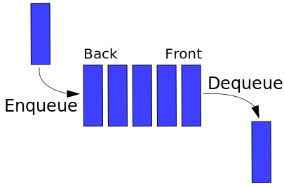

# 2. Queue using Two Stacks [Scheme]

Implement **a queue using two stacks**.

### Stacks using Lists

A **stack** (also called *Last In First Out* or *LIFO*) is a following data structure:


Stacks can be naturally implemented using Scheme lists.
Implement stack operations with the type signatures below...

* **push** that adds a new element `v` to a stack `st` (represented as a list):

```scheme
(push v st)
```

* **top** that returns the top of a stack **without** changing the stack.
In case of an empty stack return `'()`, otherwise return the element itself.

```scheme
(top st)
```

* **pop** that removes the top element (the most recently added one) from a stack:

```scheme
(pop st)
```

These operations should return **new stacks** with modified contents (depending on the called operation).

### Queues using Stacks

A **queue** (also called *First In Last Out* or *FIFO*) is a following data structure:
 

    
Unfortunately, queues are not that straightforward to implement in Scheme.
At least not with the basic data structures we have learned so far.
Using a list directly as a queue would not give desired time complexities for queue operations `enqueue` and `dequeue`.

However, it is possible to achieve at least good **amortized** complexities using **two stacks in a smart way**,
i.e., such a way that a sequence of **e** operations of `enqueue` and **d** operations of `dequeue`** would take **O(e + d)** time. 
This can be done if:
* one stack is dedicated for enqueueing incoming elements
* the other stack is dedicated for dequeueing outcoming elements

Implement such a queue.
In particular, implement a Scheme function
```Scheme
(inStackOutStack ist ost)
```
that returns a new queue with:
* `ist` is the stack dedicated for enqueueing incoming elements 
* and `ost` is the stack dedicated for dequeueing outcoming elements.

Furthermore, implement queue operations:

* **enqueue** that adds a new element **v** to the front of a queue **q**:

```scheme
(enqueue v q)
```

* **dequeue** that removes an element (the least recently added one) from the back of a queue **q**:

```scheme
(dequeue q)
```

Moreover, you may find useful to have a function that "prepares" a queue for the `dequeue` operation.
```scheme
(dispatch q)
```
This function would transform a queue by conveniently manipulating elements between the incoming stack and the outcoming stack.
Doing so, the following `dequeue` operation afterwards could be done easily and with the desired amortized time complexity.

## Examples
### Example 1 (stacks)
With following user-defined stacks:
```scheme
(define emptyStack '())
(define stack0
 (push 0 emptyStack))
(define stack01
 (push 1 stack0))
(define completeStack
 (push 7 (push 6 (push 5 (push 4 (push 3 (push 2 stack01)))))))
(define stack42
 (push 7 (push 6 (push 5 (push 42 (pop (pop (pop (pop completeStack)))))))))
(define inStack
 (push 7 (push 6 (push 5 (push 4 emptyStack)))))
(define outStack
 (push 3 (push 2 (push 1 (push 0 emptyStack)))))
(define listOfStacks
 (list emptyStack stack0 stack01 completeStack stack42 inStack outStack))
```
we get following stacks:
```
> (map displayln listOfStacks)
()
(0)
(1 0)
(7 6 5 4 3 2 1 0)
(7 6 5 42 3 2 1 0)
(7 6 5 4)
(3 2 1 0)
```
Their results of `top` operations would be:
```
> (map (lambda (st) (displayln (top st))) listOfStacks)

()
0
1
7
7
7
3
```

### Example 2 (queues)
With following user-defined queues:
```haskell
emptyStack = []
inStack  = push 7 . push 6 . push 5 . push 4 $ emptyStack
outStack = push 3 . push 2 . push 1 . push 0 $ emptyStack

q1 = InStackOutStack inStack outStack
q2 = InStackOutStack emptyStack outStack
q3 = InStackOutStack inStack emptyStack

listOfQueues = [q1, q2, q3]
```
we get:
```
*QueueStacks> map (enqueue 42) listOfQueues
[InStackOutStack [42,7,6,5,4] [3,2,1,0],InStackOutStack [42] [3,2,1,0],InStackOutStack [42,7,6,5,4] []]

*QueueStacks> map dequeue listOfQueues
[InStackOutStack [7,6,5,4] [2,1,0],InStackOutStack [] [2,1,0],InStackOutStack [] [5,6,7]]

*QueueStacks> map (dequeue . dequeue) listOfQueues
[InStackOutStack [7,6,5,4] [1,0],InStackOutStack [] [1,0],InStackOutStack [] [6,7]]

*QueueStacks> map (dequeue . dequeue . dequeue) listOfQueues
[InStackOutStack [7,6,5,4] [0],InStackOutStack [] [0],InStackOutStack [] [7]]

*QueueStacks> map (dequeue . dequeue . dequeue . dequeue) listOfQueues
[InStackOutStack [7,6,5,4] [],InStackOutStack [] [],InStackOutStack [] []]

*QueueStacks> map (dequeue . dequeue . dequeue . dequeue . dequeue) listOfQueues
[InStackOutStack [] [5,6,7],InStackOutStack [] [],InStackOutStack [] []]
```
